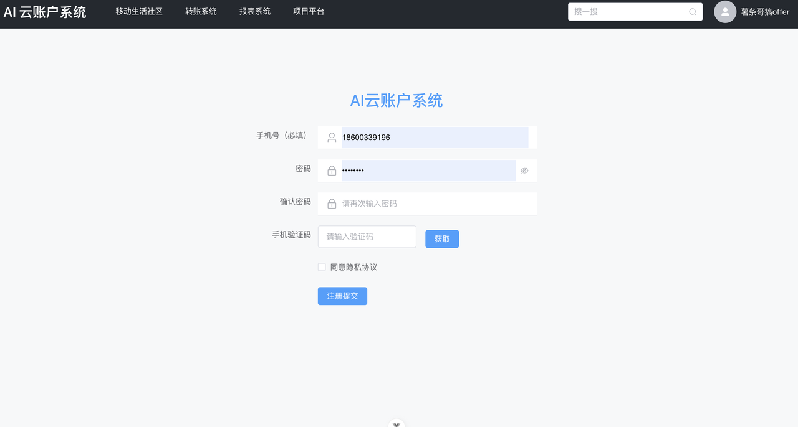
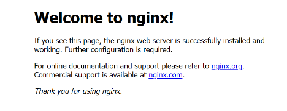

**银行科技岗必备后端项目：掌上AI银行项目（保姆级、持续更新）**

体验阅读链接：[ 薯条哥银行科技岗](https://qq5jbkqzduo.feishu.cn/wiki/FA4gwhMGqiVS4wko702cNc1Mnkf?from=from_copylink)

### 前端项目运行

准备工具：Visual Studio Code 2（1.88.0）（https://code.visualstudio.com/）

安装node 18.12.1 （https://nodejs.p2hp.com/）

拉取代码，执行以下命令

```plain text
// 进入工程目录目录  /ai-bank
// 安装前端依赖
npm install

// 运行命令
npm run dev
```

进入文件 /src/api/core/OpenAPI.ts

修改BASE 中的域名端口，为当前前端服务的域名与端口，以及前缀

进入文件 vite.config.ts，修改后端接口域名配置

```bash
server: {
    proxy: {
        '/palm': {
            target: 'http://${host}:${port}/',  // 修改该位置为自己本地后端服务以及端口
            changeOrigin: true
        }
    }
}
```

**Tips: ** 如果拉取前端依赖过慢，可以设置为淘宝的镜像源

```bash
npm config set registry https://registry.npmmirror.com/

// 查看当前源命令
// npm config get registry
```

### 前端项目预览





项目使用了银行最喜欢的Java语言，包含了最容易打动面试官的对账和转账系统，还有帮助入门同学学习的：用户系统和社区系统。

项目文档非常的详尽，考虑了完全没有基础的同学也能轻松上手和你的科技岗面试官侃侃而谈，吊打你的面试官。

- [ ] 项目使用文档

- [ ] java学习课程文档（薯条哥专属课程）

- [ ] redis学习课程文档（薯条哥专属课程）

- [ ] mysql学习课程文档（薯条哥专属课程）

- [ ] 项目产品需求文档

- [ ] 项目功能技术文档

- [ ] 4次课后作业

大家可以感受下文档的详细程度，薯条哥精心打磨。

后端代码


前端代码


### 前端项目部署

执行命令，打包前端项目

```bash
npm run build

// 打包成功后会看到根目录出现一个dist文件夹

// 打包报错一般是ts类型问题，可以进行类型断言或者在代码上一行添加忽略错误注释 // @ts-ignore

// example
let a: number = 1;

// @ts-ignore
a = '2'; // 项目中a的类型为数字，这里赋值为字符串，类型报错会导致编译报错，// @ts-ignore会告诉编译器忽略这个错误

// tips: 这里不是在教大家如何规避错误，而是让大家更快的熟悉整个流程，这些详细的知识，需要慢慢理解学习~
```

#### macOS版本

打开终端，执行命令

```bash
// 安装Homebrew  如果已安装可跳过该命令
/bin/bash -c "$(curl -fsSL https://raw.githubusercontent.com/Homebrew/install/HEAD/install.sh)"

// 更新Homebrew
brew update

// 安装nginx
brew install nginx

// 启动nginx
sudo nginx
```

找到nginx所在文件夹 /usr/local/etc/nginx 或者是 /usr/local/Cellar/nginx ，打开nginx文件目录

将dist文件夹拷贝到 html文件夹中

修改nginx.conf 配置

```bash
 // 端口和域名 与文件/src/api/core/OpenAPI.ts 中保持一致即可
 listen       5173;
 server_name  localhost;

 location / {
     root /usr/local/etc/nginx/html;
     index index.html index.htm;
     try_files $uri $uri/ /index.html;
 }

 // 配置接口转发
 location /palm/ {
     proxy_pass http://host:port; // host 后端域名  port 后端端口
     proxy_redirect off;
     proxy_read_timeout 600;
     proxy_set_header X-Real-IP $remote_addr;
     proxy_set_header X-Forwarded-For $http_x_forwarded_for;
 }

```

然后重启nginx即可

```bash
sudo nginx reload
```

#### windows版本

下载window版本的nginx（http://nginx.org/en/download.html）解压到指定目录

打开nginx所在目录，双击nginx.exe，查看 http://localhost:80 如果有下面的图片则启动成功

剩余nginx配置按照macOS版本进行配置即可


